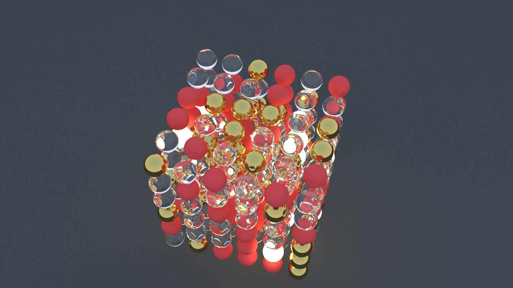

# Rayfloat

A multithreaded, Monte Carlo CPU path tracer using a Whitted-style, iterative light transport integrator built to study performance, memory behaviour and algorithmic bottlenecks on multi-core CPUs.

## Table of Contents

1. [Demo](#demo)
2. [Highlights](#highlights)
3. [Documentation](#documentation)
4. [Build Instruction](#build)
5. [Future Work](#future-work)
6. [References](#references)

## Demo



## Highlights

- Materials are modeled as _BSDF-like_ scattering functions that stochastically generate outgoing rays and attenuate energy (lambertian, dielectric, metal, emissive)
- Parallelizes rendering across image rows using OpenMP and employs a thread-local RNG (XorShift)
- Iterative ray traversal (no recursion)
- Bounding Volume Hierarchy (Median Split Strategy) has been implemented

## Documentation

WIP

## Build

### Standard 

Have CMake installed.  
Use this when you just want to generate your image.

```bash
mkdir build && cd build
cmake -DCMAKE_BUILD_TYPE=Release ..

make
./raytracer
```

### Profiling

```bash
cmake -DCMAKE_BUILD_TYPE=Profile ..
make
# this runs the code, creates gmon.out, and generates analysis.txt
make analyze
```

Use `feh output/image.ppm` to view the generated image.

## Future Work

WIP

## References

WIP

