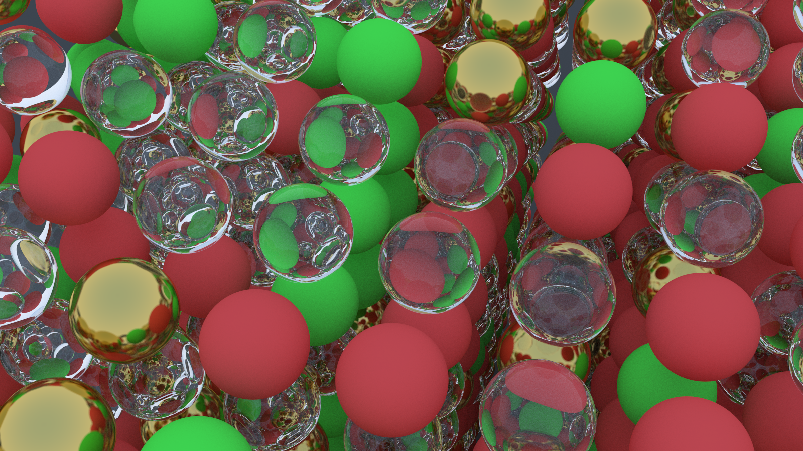
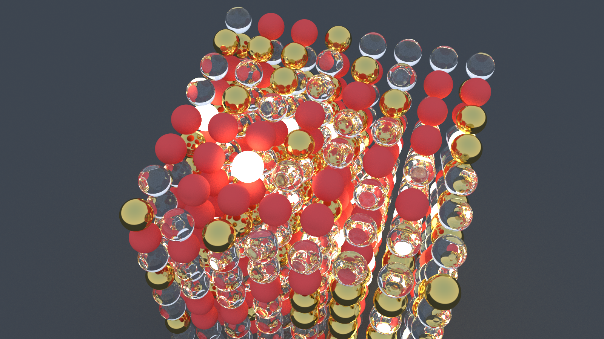

# Rayfloat

A multithreaded, BVH enabled, cpu path tracer using a Whitted-style, iterative light transport integrator built to study performance, memory behaviour and algorithmic bottlenecks on multi-core CPUs.

## Table of Contents

1. [Demo](#demo)
2. [Highlights](#highlights)
3. [Documentation](#documentation)
4. [Build Instruction](#build)
5. [Future Work](#future-work)
6. [References](#references)

## Demo





## Highlights

- Materials are modeled as _BSDF-like_ scattering functions that stochastically generate outgoing rays and attenuate energy (lambertian, dielectric, metal, emissive)
- Parallelizes rendering across image rows using OpenMP and employs a thread-local RNG (XorShift)
- Iterative ray traversal (no recursion)
- Bounding Volume Hierarchy (Median Split Strategy) has been implemented

## Write-up

- [Why My Ray Tracer Got Slower Before It Got Faster](docs/blog.md)

## Build

### Standard 

Have CMake installed.  
Use this when you just want to generate your image.

```bash
mkdir build && cd build
cmake -DCMAKE_BUILD_TYPE=Release ..

make
./raytracer
```

### Profiling

```bash
cmake -DCMAKE_BUILD_TYPE=Profile ..
make
# this runs the code, creates gmon.out, and generates analysis.txt
make analyze
```

Use `feh output/image.ppm` to view the generated image.

## Future Work

1. AoS to SoA
2. SIMD vectorization
3. More primitive shapes
4. Define explicit distribution functions for material types 
5. .obj file loading

## References

1. [Ray Tracing in One Weekend](https://raytracing.github.io/) by Sherley, Black and  Hollasch
2. [What Every Programmer Should Know about Memory](https://people.freebsd.org/~lstewart/articles/cpumemory.pdf) by U Drepper
3. [BVH - PBR Book](https://www.pbr-book.org/3ed-2018/Primitives_and_Intersection_Acceleration/Bounding_Volume_Hierarchies)
4. [BVH (Morton Codes) - Ten Minute Physics (Video)](https://www.youtube.com/watch%3Fv%3DLAxHQZ8RjQ4&ved=2ahUKEwiNkqmK3fSRAxW3SWwGHXyMEF8QkPEHegQIRRAB&usg=AOvVaw2RrvevItOsvs5jSBWDEM6u)
5. [A reddit post on r/nvidia](https://www.reddit.com/r/nvidia/comments/9cl35l/found_a_good_explanation_on_bvh_for_real_time_ray/) on BVH
6. [HackerNews thread on Fast and Slow If statements](news.ycombinator.com/item?id=1377423)
7. [How Branch Prediction Works on CPUs - Computerphile (Video)](https://www.youtube.com/watch?v=nczJ58WvtYo)

