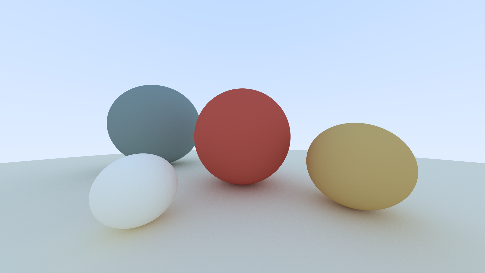

# Why My Ray Tracer Got Slower Before It Got Faster


At first glance, building a CPU ray tracer in 2026 seems misguided. Modern GPUs are architected specifically for ray traversal, massive SIMD execution, and high-throughput shading. A GPU implementation would be orders of magnitude faster.

That was _never_ the point.

The goal of this project was not raw throughput but to build mechanical sympathy. The CPU exposes the full performance stack: branch prediction, cache coherence, memory latency, instruction scheduling and parallel scaling. On a GPU, many of these costs are amortized or hidden by hardware.

This project was strongly influenced by Ulrich Drepper’s [_What Every Programmer Should Know About Memory_](https://people.freebsd.org/~lstewart/articles/cpumemory.pdf). 

All experiments were conducted on an Intel i7-8650U. The same scene (5 spheres, 400px width, 16:9 ratio, 500 samples per pixel, and maximum bounce depth of 10; shown below) was used as the test sample.



The key metrics I focused on were real time, user time and parallel efficiency.

_Spoiler: I micro-optimized before I algorithmed. And nearly set my ThinkPad on fire whie trying to render 64,000 spheres~_

## The Deceptively Simple Problem

A brief overview of the ray tracing algorithm follows:

Ray tracing is conceptually very easy and elegant. For every pixel on screen, we shoot a ray from a _virtual camera_ (in our case, a pinpoint one) through that pixel's position in 3D space. If the ray hits an object, we calculate how light bounces off the surface by recursively tracing more rays. If we miss everything, we return the sky gradient color. The algorithm itself is embarrassingly parallel, for each pixel can be computed independently. 

The math is straightforward too. A sphere defined as `(P-C)*(P-C) = r^2`. When we substitute a ray equation `P(t) = A + t*B` into this, we get a quadratic equation. This quadratic dominates hot loops.

If the discriminant is positive, our ray intersects the sphere at two points, we take the closest intersection within our view distance, calculate the surface normal, determine how the material scatters light, and recursively trace the scattered ray.

## Ray Tracing as a Workload

Every pixel is independent. I had eight logical cores available. I was expecting an 8x speedup after implementing multithreading.

The question is whether the machine can exploit this parallelism or whether the memory hierarchy and shared resources create bottlenecks that scale poorly.

Profiling the single threaded baseline (~6.7s) with `gprof` revealed that 35% was sphere intersection tests, 25-30% in vector operations that were inlined into intersection loops, and remaining time in material scattering and ray generation.

## The Cache Coherence Tax

I added OpenMP parallelization to my main rendering loop and watched in utter confusion as my render time increased from 6.7s to 9.5s. The threads were fighting each other.

I traced through the call chain and focused on the `random_double()`.

Ray tracing needs lots of random numbers for sampling and material scattering. My implementation used `std::mt19937`, the Mersenne Twister random number generator from the C++ standard library. 

After reading the [original paper](https://dl.acm.org/doi/pdf/10.1145/272991.272995) by Matsumoto and Nishimura, I suspected it was the culprit. The method is "more random" than some randoms, but it has a massive internal state (624 32-bit integers, 2,496 bytes plus and index), and every call modifies that state.

After going through some QnAs on StackOverflow, a sentence from [this](https://stackoverflow.com/a/8770030) answer caught my eye: "to be able to use a random number generator in multithreaded environment you will need an implementation that allows passing in the state". 

Each call to std::mt19937 mutates a large shared state spread across multiple cache lines. Under OpenMP, this caused heavy cache coherence traffic as cores repeatedly transitioned cache lines between Modified and Invalid states. With hundreds of millions of RNG calls, coherence stalls dominated execution time.

Hence I made some changes and used the `thread_local` keyword. My code looked like this:

```cpp
#include <random>

inline double random_double() {
    // thread_local: each thread gets its own private copy that persists
    static thread_local std::uniform_real_distribution<double> distribution(0.0, 1.0);
    static thread_local std::mt19937 generator;  
    return distribution(generator);
}
```
But I thought, what if the generator starts with the same seed in every thread? So I gave each thread a unique start or seed:

```cpp
static thread_local std::mt19937 generator(std::random_device{}() + omp_get_thread_num());
```
The runtime dropped to 4.4 seconds. The CPU utilization jumped to nearly 8x scaling, as measured by the user time to real time.

Although my CPU exposes 8 logical threads via hyperthreading, it has only 4 physical cores. A 6.7 s single-threaded baseline therefore suggests an ideal lower bound closer to ~1.7s. Instead, I was seeing 4.4s.

Although wall clock time dropped, cumulative user time increased significantly, indicating that parallel execution introduced substantial overhead from cache misses, synchronization, and reduced single-core efficiency.

I kept thinking about the RNG, to squeeze out more performance. So I implemented a new RNG called XorShift32. 
It has only 4 bytes of state and can be fully inlined. The runtime dropped to 3.9s (11% improvement!)

```cpp
inline double random_double() {
	static thread_local uint32_t state = 123456789 + omp_get_thread_num();
	state ^= state << 13;
	state ^= state >> 17;
	state ^= state << 5;
	// map to [0, 1) using bit magic
	return state / 4294967296.0;
}
```

Why does this matter so much? Since RNG is invoked billions of times, reducing its memory footprint allows the state to remain in registers or L1 cache, dramatically reducing latency.

Similarly, while working on the `vec.h`, I made sure to pass const references for read only operations and only materialize new vectors when absolutely necessary. Otherwise I would be passing objects by value which meant copying memory around. 

## The Branch Prediction Cost

My `ray_color()` function was recursive. When a ray hit a surface, it would scatter a new ray and recursively call itself to trace that bounce. This is the most intuitive way to write the algorithm and matches the physics perfectly. But recursion DOES have costs that are not obvious in the source code.

I ran two diagnostic tasks to confirm my hypothesis:

1. Threading validation (50 samples per pixel instead of 500)

If threading overhead was the bottleneck, reducing samples per pixel should scale linearly with core count.
The result showed a 7.8x ratio (0.41s real time, 3.2s user time). Therefore it was a near perfect 8 core scaling. 

2. Depth ablation (reducing max_depth from 10 to 3)

If recursion overhead dominated, reducing bounce depth should disproportionately cut CPU work:

The execution time dropped from ~4.4s to ~3.4s. This 1 second delta (23% speedup) revealed that the heavy lifting is at depth 0-2. The fact that the program still takes ~3.4s even with minimal depth proves that the primary bottleneck is the initial ray scene intersection and the high sampling rate. The first hit is most expensive.

So I dug deeper and figured out the possible reasons why recursion hurts so much even in parallel code.

Each recursive call to `ray_color()` introduces stack activity and constrains the compiler’s ability to keep state in registers. Although the maximum recursion depth was limited, the combination of deep call chains and billions of invocations increased register pressure, stack traffic, and instruction overhead across all threads.

In addition, recursive control flow degrades branch and return prediction accuracy. Modern CPUs rely on a return stack buffer (RSB) to predict function returns efficiently, but deeply nested and irregular recursion patterns reduce prediction accuracy and increase pipeline recovery cost.

The compiler could not eliminate the recursion because the ray accumulation depended on the return value:

```cpp
return attenuation * ray_color(scattered, world, depth - 1);
```

Since the multiplication occurs after the recursive call returns, each stack frame must remain live, preventing tail call optimization.

Refactoring `ray_color()` into an explicit iterative loop removed these constraints. Ray state and accumulated attenuation were tracked manually in local variables, allowing the compiler to keep them in registers and generate a tight inner loop with fewer memory accesses and more predictable control flow. This change alone reduced runtime from 4.4 s to 3.8 s, a ~15% improvement.

To verify that remaining overheads were largely eliminated, I scaled the image resolution from 400x400 to 800x450 (around 4× more pixels). Render time increased by 3.95x, indicating near linear scaling and confirming that performance was no longer dominated by control flow or bookkeeping overhead.

## Why 8 Cores Don't Give 8x Speed

Although my CPU exposes 8 logical threads via hyperthreading, it has only 4 physical cores. A 6.7 s single-threaded baseline therefore suggests an ideal lower bound closer to ~1.7 s, not ~0.8 s. In practice, the fastest version reached ~3.14 s.

Hyperthreading improves utilization by overlapping stalled execution, but it does not double execution resources. Threads still compete for the same core pipelines, private L2 caches, shared L3 cache, and a single memory controller and ray tracing’s irregular memory access patterns limit how much useful work a second hardware thread can extract.

With all cores active, the CPU also downclocks to remain within power and thermal limits, further reducing per-thread throughput. Taken together, these effects explain why scaling saturated well before linear speedup and why the remaining gap was hardware-, not software-, bound.

## BVH: When Algorithm Beats Micro-optimization

Up to this point, every ray was still being tested against every sphere. No amount of micro optimization could save an O(n) algorithm executed billions of times.

### The Core Problem: Spatial Search Complexity

In the naive implementation, testing whether a ray hits anything requires checking every object in the scene. For n objects and m rays, that's O(n * m) intersection tests. With 500 samples per pixel, 10 bounces per ray, and millions of pixels, we're talking about billions of sphere intersection tests.

A Bounding Volume Hierarchy (BVH) transforms this from a linear search into a logarithmic one. Instead of testing every object, we organize geometry into a binary tree of progressively tighter bounding boxes. This reduces intersection tests from O(n) to O(log n) per ray.

### How BVH Construction Works

The BVH is built recursively in a top-down manner:

1. For each node, we randomly select one of the three spatial axes (x, y, or z). This randomization prevents pathological cases where the scene geometry happens to align poorly with a fixed splitting strategy.

2. We sort all objects in the current subset by their bounding box centroid along the chosen axis. This is the most expensive part of construction ( O(n log n) ) for the entire tree.

3. Split the sorted list at the midpoint. This guarantees a balanced tree with depth O(log n), which is critical for query performance. An unbalanced tree degenerates toward O(n) traversal.

4. Each half becomes a child subtree. We continue until reaching leaf nodes (1-2 objects).

5. After constructing both children, we compute the parent's AABB as the union of the two child boxes using `surrounding_box()`.

Here's what the construction looks like in code:

```cpp
BVHNode(std::vector<std::shared_ptr<Hittable>>& objects, size_t start, size_t end) {

    int axis = random_int(0, 2);
    auto comparator = (axis == 0) ? box_x_compare
                    : (axis == 1) ? box_y_compare
                                    : box_z_compare;
    size_t object_span = end - start;

    if (object_span == 1) {
        left = right = objects[start];
    } else if (object_span == 2) {
        if (comparator(objects[start], objects[start + 1])) {
            left = objects[start];
            right = objects[start + 1];
        } else {
            left = objects[start + 1];
            right = objects[start];
        }
    } else {
        std::sort(objects.begin() + start, objects.begin() + end, comparator);

        size_t mid = start + object_span / 2;
        left = std::make_shared<BVHNode>(objects, start, mid);
        right = std::make_shared<BVHNode>(objects, mid, end);
    }

    AABB box_left, box_right;
    if (!left->bounding_box(box_left) || !right->bounding_box(box_right))
        throw std::runtime_error("No bounding box in BVHNode constructor.");
    box = AABB::surrounding_box(box_left, box_right);
}
```

### The Critical Traversal Algorithm

Once built, the BVH traversal is where the speedup happens. The algorithm is simple:

```cpp
bool hit(const Ray& ray, double t_min, double t_max, HitRecord& record) const override {
    if (!box.hit(ray, t_min, t_max))
        return false;

    bool hit_left = left->hit(ray, t_min, t_max, record);
    bool hit_right = right->hit(ray, t_min, hit_left? record.t:t_max, record);

    return hit_left || hit_right;
}
```

If the left child hits at distance `t`, we don't care about right child hits beyond that distance. By passing `record.t` as the new `t_max`, we aggressively cull geometry that's occluded.

### Why AABB Intersection is Cheap

The axis-aligned bounding box test is the workhorse of the BVH. It needs to be fast because we're calling it at every tree node:

```cpp
bool hit(const Ray& r, double t_min, double t_max) const {
    for(int a = 0; a < 3; ++a) {
        double origin_component = (a==0)? r.origin.x : (a==1)? r.origin.y : r.origin.z;
        double direction_component = (a==0)? r.direction.x : (a==1)? r.direction.y : r.direction.z;
        double min_component = (a==0)? minimum.x : (a==1)? minimum.y : minimum.z;
        double max_component = (a==0)? maximum.x : (a==1)? maximum.y : maximum.z;

        double invD = 1.0 / direction_component;
        double t0 = (min_component - origin_component) * invD;
        double t1 = (max_component - origin_component) * invD;
        if (invD < 0.0) std::swap(t0, t1);
        t_min = t0 > t_min ? t0 : t_min;
        t_max = t1 < t_max ? t1 : t_max;
        if (t_max <= t_min)
            return false;
    }
    return true;
}
```

This slab test uses the ray-plane intersection formula. For each axis, we compute where the ray intersects the near and far planes of the box. The ray hits the box only if these intervals overlap on all three axes.

Building the BVH isn't free. The `std::sort` calls dominate construction time O(n log n) for the entire tree because we sort at every level. For my 5-sphere test scene, construction took ~0.02ms, which is noise. But for complex scenes, this becomes measurable.

The original single-threaded ground truth was 6.7s. My first parallel attempt before BVH was 3.14s. With BVH we hit ~2.84s, only an ~11% improvement. 

So I set up a benchmark with N^3 grids of spheres to find where BVH becomes worthwhile.


We can see that naive rendering grows superlinearly and quickly becomes impractical, whereas BVH keeps growth much closer to linear over this range.

No amount of SIMD, cache optimization, or clever micro-optimization can make O(n) competitive with O(log n) at scale :)

The BVH I implemented uses random axis selection and median splits. More sophisticated strategies exist (like SAH, Binned SAH, using Morton Codes etc.) but I stuck with the simple approach because it's cache-friendly (balanced tree, predictable memory layout) and construction is fast enough to be irrelevant in my workflow. 

Production ray tracers take this much further with packet traversal (tracing multiple rays through the BVH simultaneously) and SIMD-optimized box tests. These techniques can achieve another 2-3x on top of the basic BVH, but they require substantial code restructuring.

The BVH transformed my ray tracer from a toy into something that could handle moderately complex scenes. But more importantly, it demonstrated that _picking the right algorithm_ has more impact than any amount of low-level optimization.

## Limits of Silicon

To test the limits, I attempted to render a stress-test scene, an N=40 (64,000 spheres) scene utilizing glass and emissive materials as well.

For 40 minutes, my i7-8650U sat pinned at 90 degrees Celcius. Then, the hardware started to give up. My cooling fan, which had been screaming at 4,000 RPM, suddenly plummeted to 1,000, then 600 RPM. The fan began making a mechanical grinding sound, the kind of noise that gives a laptop owner long lasting trauma. I was forced to perform an emergency shutdown to save the motherboard from literal meltdown.

Nevertheless, I rendered a similar scene with N=13, after removing the emissive material type (to reduce the light transport complexity).


## It never really ends

All I have understood is that, fast code is the code which respects the machine.

Each bottleneck revealed the next one. Compiler flags exposed threading issues. Threading exposed memory contention. Fixing memory exposed recursion overhead. Fixing recursion exposed algorithmic limits. 

Now I am eyeing SIMD and wondering if I can push this furhter. The thing about optimization is that it never really ends -- you just run out of time or interest. I am not sure which will happen first.

The code is on [Github](https://github.com/datavorous/rayfloat).

## References

1. [Ray Tracing in One Weekend](https://raytracing.github.io/) by Sherley, Black and  Hollasch

2. [What Every Programmer Should Know about Memory](https://people.freebsd.org/~lstewart/articles/cpumemory.pdf) by U Drepper

3. [BVH - PBR Book](https://www.pbr-book.org/3ed-2018/Primitives_and_Intersection_Acceleration/Bounding_Volume_Hierarchies)

4. [BVH (Morton Codes) - Ten Minute Physics (Video)](https://www.youtube.com/watch%3Fv%3DLAxHQZ8RjQ4&ved=2ahUKEwiNkqmK3fSRAxW3SWwGHXyMEF8QkPEHegQIRRAB&usg=AOvVaw2RrvevItOsvs5jSBWDEM6u)

5. [A reddit post on r/nvidia](https://www.reddit.com/r/nvidia/comments/9cl35l/found_a_good_explanation_on_bvh_for_real_time_ray/) on BVH

6. [HackerNews thread on Fast and Slow If statements](news.ycombinator.com/item?id=1377423)

7. [How Branch Prediction Works on CPUs - Computerphile (Video)](https://www.youtube.com/watch?v=nczJ58WvtYo)